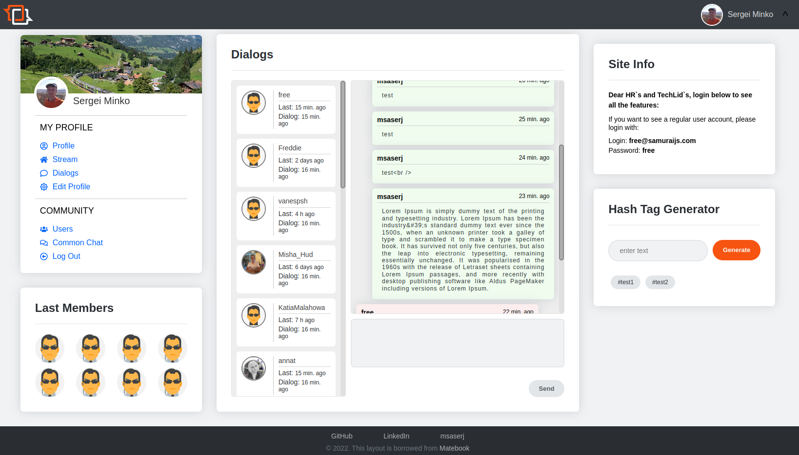

<h1 align="center">Social Network</h1>
<h2 align="center">

</h2>

<p align="center">


</p>

<h2 align="center"><a  href="https://msaserj.github.io/socialnetwork">Live Demo</a></h2>

## ✏️ Description

**This is a tutorial project on creating a social network interface. The interaction takes place with a real backend.**

<p align="center"></p>

## 📝 About the project.

What is implemented here?

1. Registration flow. Forms of registration, authorization, password recovery.
2. Viewing and searching for users, some sorting points, as well as subscribing to users.
3. Viewing the user's profile, a form for editing your profile, the ability to change the profile photo.
4. Implemented a small general chat for all users on web sockets.
5. As for the layout, I used grid-layout and flex for better responsibility, and preproc SCSS.

You can also register and test this project.

## Technologies

**React**,
**Redux**,
**Redux-Toolkit**,
**TS**,
**SCSS**.

## Project setup

```sh
npm install
npm run serve
```

#### use yarn

```sh
yarn
yarn start
```

## Future scope

- Add documentation for components such as StoryBook.

## My Home Page

[Sergei Minko aka msaserj](https://msaserj.ru)
